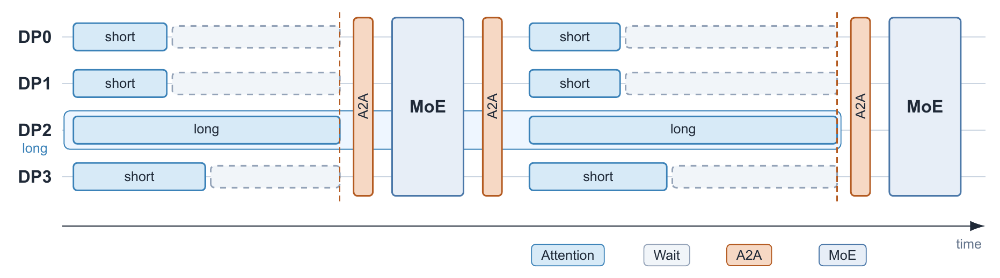
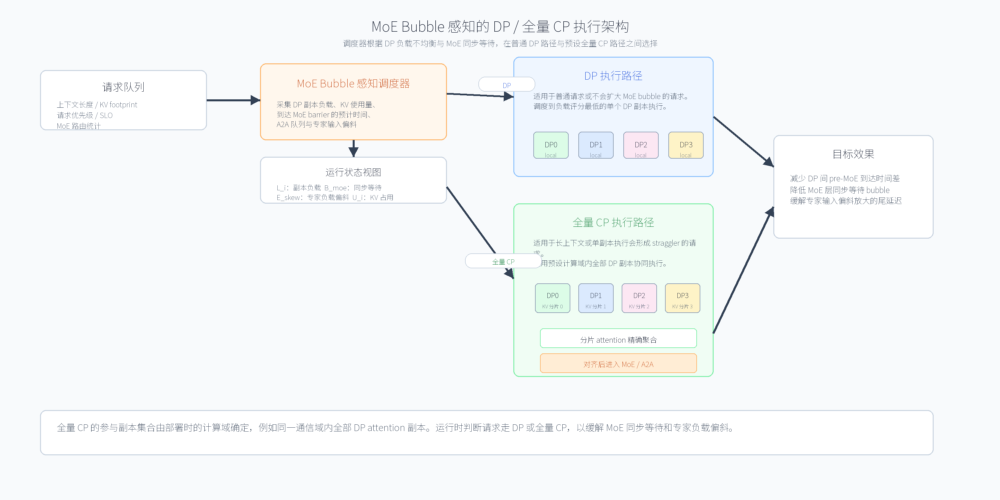
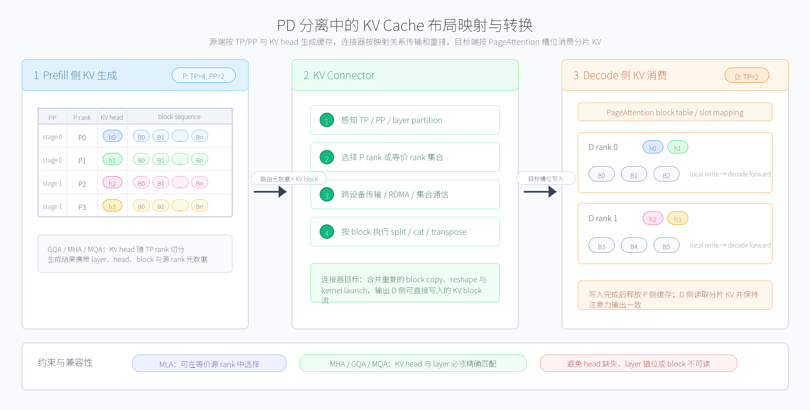
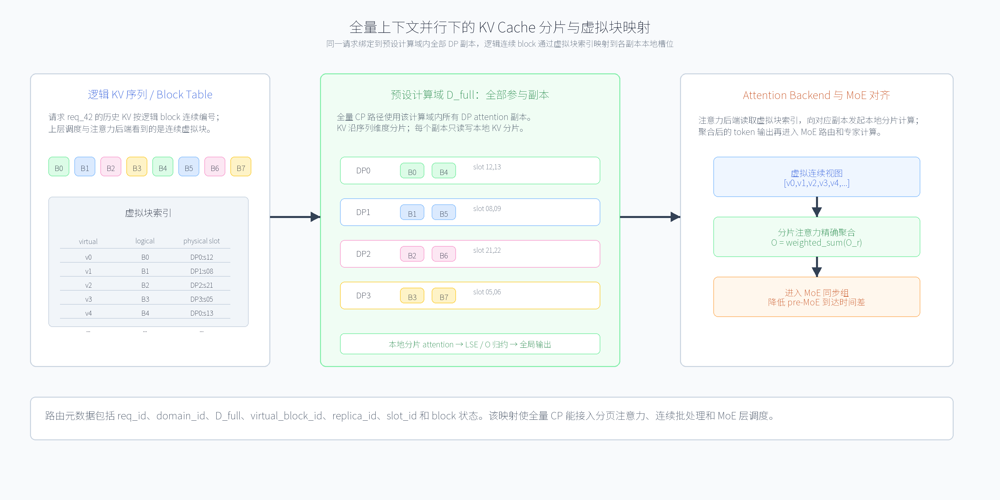

# 大模型推理中缓解 MoE 气泡的全量上下文并行调度方法、装置、电子设备和计算机可读介质

## 摘要

本申请实施例公开了一种大模型推理中缓解混合专家模型 MoE 气泡的全量上下文并行调度方法、装置、电子设备和计算机可读介质。主要技术方案包括：接收大模型推理请求，获得上述推理请求的上下文长度、键值缓存需求量、服务等级目标以及 MoE 层路由相关统计；采集多个数据并行计算副本的运行状态，上述运行状态包括各计算副本的键值缓存使用量、待处理请求数、注意力阶段预计完成时间、MoE 层同步等待时间、专家输入负载偏斜和跨副本通信状态；根据上述运行状态估计将上述推理请求以数据并行路径执行时产生的 MoE 气泡代价，以及将上述推理请求以预设计算域内全量上下文并行路径执行时产生的 MoE 气泡代价和通信代价；在上述全量上下文并行路径能够降低数据并行副本间到达 MoE 层的时间差或专家负载偏斜的情况下，将上述推理请求绑定至上述预设计算域内的全部参与副本，将键值缓存沿序列维度分片至上述全部参与副本，并聚合各参与副本的分片注意力计算结果；否则，将上述推理请求调度至单个目标计算副本以数据并行路径执行。该方式在数据并行路径和预设全量上下文并行路径之间进行运行时选择，能够缓解数据并行副本间负载不均衡导致的 MoE 同步等待气泡，降低尾延迟并提升大模型推理吞吐。

## 权利要求书

1. 一种大模型推理中缓解 MoE 气泡的全量上下文并行调度方法，其特征在于，所述方法包括：

   接收大模型的推理请求，获得所述推理请求的上下文长度、键值缓存需求量、服务等级目标以及 MoE 层路由相关统计；

   获得推理系统中多个数据并行计算副本的运行状态，所述运行状态包括各计算副本的键值缓存使用量、待处理请求数、注意力阶段预计完成时间、MoE 层同步等待时间、专家输入负载偏斜和跨副本通信状态；

   根据所述运行状态估计所述推理请求在数据并行路径下的第一气泡代价，以及所述推理请求在预设计算域内全量上下文并行路径下的第二气泡代价和通信代价；

   响应于所述第二气泡代价低于所述第一气泡代价且所述通信代价满足预设约束，将所述推理请求绑定至所述预设计算域内的全部参与副本，以全量上下文并行路径执行；

   响应于所述第二气泡代价不低于所述第一气泡代价或所述通信代价不满足预设约束，将所述推理请求调度至一个目标计算副本，以数据并行路径执行；

   其中，所述全量上下文并行路径包括：将所述推理请求的键值缓存沿序列维度分片至所述全部参与副本，维护跨副本缓存映射，由所述全部参与副本基于本地键值缓存分片执行分片注意力计算，并聚合分片注意力计算结果以生成所述推理请求的输出 token。

2. 根据权利要求 1 所述的方法，其特征在于，所述 MoE 层路由相关统计包括以下至少一种：各 MoE 层的专家命中计数、top-k 路由分布、专家容量因子、被丢弃或重路由的 token 数、专家输入 token 数的方差、最大专家输入 token 数与平均专家输入 token 数的比值。

3. 根据权利要求 1 所述的方法，其特征在于，所述第一气泡代价根据将所述推理请求分配至单个目标计算副本后，所述目标计算副本到达 MoE 同步点的预计时间与同一 MoE 同步组内其他计算副本到达 MoE 同步点的预计时间之间的差值确定。

4. 根据权利要求 1 所述的方法，其特征在于，所述第二气泡代价根据所述全量上下文并行路径下各参与副本的注意力阶段分片执行时间、分片结果聚合时间、MoE 层同步点到达时间以及专家输入负载偏斜确定。

5. 根据权利要求 1 所述的方法，其特征在于，所述预设计算域由部署配置确定，包括同一通信域内的全部数据并行计算副本、同一节点内的全部数据并行计算副本或跨节点通信带宽满足预设条件的一组数据并行计算副本；所述全量上下文并行路径使用所述预设计算域内的全部参与副本。

6. 根据权利要求 1 所述的方法，其特征在于，所述目标计算副本由中心化调度器选择，所述中心化调度器维护全局等待队列以及各计算副本的键值缓存使用量、待处理请求数和 MoE 气泡统计，并选择综合负载评分最低且剩余键值缓存容量满足所述推理请求需求的计算副本作为目标计算副本。

7. 根据权利要求 6 所述的方法，其特征在于，所述综合负载评分根据键值缓存使用量、待处理请求数、预计注意力完成时间、历史 MoE 同步等待时间和专家负载偏斜中的至少一种确定。

8. 根据权利要求 1 所述的方法，其特征在于，所述将所述推理请求的键值缓存沿序列维度分片至所述全部参与副本，包括以下至少一种：按照连续 token 区间分片、按照固定大小的键值缓存块轮转分片、按照预设交错粒度在多个参与副本间交错分片。

9. 根据权利要求 1 所述的方法，其特征在于，所述维护跨副本缓存映射，包括：维护二维槽位映射表，所述二维槽位映射表的第一维对应参与副本标识，第二维对应序列位置或缓存块编号，所述二维槽位映射表中的元素记录物理槽位编号、块状态、引用计数、所属请求标识和数据可读状态。

10. 根据权利要求 9 所述的方法，其特征在于，所述方法还包括：基于所述二维槽位映射表生成虚拟块索引，并将所述虚拟块索引提供给注意力后端，使所述注意力后端通过逻辑连续的虚拟块访问分布在所述全部参与副本上的键值缓存。

11. 根据权利要求 1 所述的方法，其特征在于，所述聚合分片注意力计算结果，包括：各参与副本分别基于本地键值缓存分片计算本地注意力输出 O_r 和本地指数归一化统计量 LSE_r；在参与副本之间交换或归约各自的 LSE_r，并确定 LSE_max = max_r(LSE_r)；根据 w_r = exp(LSE_r − LSE_max) 计算各参与副本的输出权重；按照 O = (Σ_r w_r·O_r) / (Σ_r w_r) 聚合各参与副本的本地注意力输出，得到与未分片注意力计算一致的全局注意力输出。

12. 根据权利要求 1 所述的方法，其特征在于，所述方法还包括：在全量上下文并行路径下，为所述推理请求生成路由元数据，所述路由元数据包括请求标识、预设计算域标识、全部参与副本集合、跨副本缓存映射和结果聚合路径，并将所述路由元数据注入批次执行描述符或计算图。

13. 根据权利要求 1 所述的方法，其特征在于，所述方法还包括：在所述全部参与副本完成分片注意力结果聚合后，使所述全部参与副本在同一 MoE 同步组内进入 MoE 层的专家路由、跨专家通信或专家前馈计算，以降低所述同一 MoE 同步组内的等待时间差。

14. 根据权利要求 1 所述的方法，其特征在于，所述方法还包括：根据连续多个解码步中的 MoE 同步等待时间和专家输入负载偏斜更新气泡代价估计参数，并在后续请求到达时利用更新后的气泡代价估计参数在数据并行路径和全量上下文并行路径之间进行选择，其中所述预设计算域内的参与副本集合保持不变。

15. 根据权利要求 1 所述的方法，其特征在于，所述方法还包括：在预填充阶段和解码阶段部署在不同计算设备组的情况下，根据源端并行配置、目标端并行配置以及注意力结构确定键值缓存布局映射关系，并按照所述键值缓存布局映射关系传输和转换键值缓存。

16. 根据权利要求 15 所述的方法，其特征在于，所述键值缓存布局映射关系包括键值头编号、层编号、源端张量并行标识、目标端张量并行标识、源端流水并行阶段和目标端流水并行阶段之间的映射关系；所述注意力结构包括多头注意力、分组查询注意力、多查询注意力或多头潜在注意力中的至少一种。

17. 一种大模型推理中缓解 MoE 气泡的全量上下文并行调度装置，其特征在于，所述装置包括：

   请求分析模块，被配置为接收大模型的推理请求，获得所述推理请求的上下文长度、键值缓存需求量、服务等级目标以及 MoE 层路由相关统计；

   状态采集模块，被配置为获得推理系统中多个数据并行计算副本的键值缓存使用量、待处理请求数、注意力阶段预计完成时间、MoE 层同步等待时间、专家输入负载偏斜和跨副本通信状态；

   气泡代价估计模块，被配置为估计所述推理请求在数据并行路径下的第一气泡代价，以及在预设计算域内全量上下文并行路径下的第二气泡代价和通信代价；

   路径选择模块，被配置为在所述第二气泡代价低于所述第一气泡代价且所述通信代价满足预设约束时选择全量上下文并行路径，否则选择数据并行路径；

   缓存分片管理模块，被配置为在全量上下文并行路径下将键值缓存沿序列维度分片至全部参与副本，并维护跨副本缓存映射和虚拟块索引；

   注意力执行模块，被配置为执行分片注意力计算并聚合分片注意力计算结果；

   MoE 对齐模块，被配置为根据注意力阶段完成时间和 MoE 层同步等待时间调度所述推理请求进入 MoE 层。

18. 一种电子设备，其特征在于，包括：一个或多个处理器；与所述一个或多个处理器关联的存储器，所述存储器用于存储程序指令，所述程序指令在被所述一个或多个处理器读取执行时，执行权利要求 1 至 16 中任一项所述的方法的步骤。

19. 一种计算机可读介质，其上存储有计算机程序，其特征在于，该程序被处理器执行时实现如权利要求 1 至 16 中任一项所述的方法的步骤。

20. 一种计算机程序产品，包括计算机程序，其特征在于，该计算机程序被处理器执行时实现权利要求 1 至 16 中任一项所述方法的步骤。

## 说明书

### 技术领域

本申请涉及人工智能推理服务、混合专家模型、分布式并行计算、上下文并行、数据并行负载均衡和键值缓存管理技术领域，特别是涉及一种大模型推理中缓解 MoE 气泡的全量上下文并行调度方法、装置、电子设备和计算机可读介质。

### 背景技术

大模型推理通常采用自回归生成方式。对于长文档理解、代码仓库分析、知识库问答和智能体任务规划等场景，单个请求可能包含数万至数十万 token 的上下文，甚至达到百万 token。随着上下文长度增长，推理服务不仅面临更高的首字时延，还会在解码阶段持续访问不断增长的键值缓存（KV Cache）。

在解码阶段，每生成一个 token，注意力计算需要访问历史 token 对应的键值缓存。对于一个具有 n_layers 层、每层 n_kv_heads 个键值头、每个键值头维度为 d_head、以 B_dtype 字节存储键值缓存的模型，当上下文长度达到 L 时，单个请求的键值缓存总字节数（即请求级键值缓存足迹 F）可表示为 F = 2 × n_layers × L × n_kv_heads × d_head × B_dtype。当 L 较大时，键值缓存读取量远超模型权重读取量，成为 HBM 访问的主导成分。受限于 HBM 带宽 B_hbm，键值缓存读取时间 T_kv_read = F / B_hbm 将随 L 线性增长并成为逐词时延和尾延迟的重要来源。

在数据并行推理服务中，不同请求通常被分配到不同计算副本执行。如果少量长上下文请求集中在某些数据并行副本上，这些副本在注意力阶段需要遍历更大的键值缓存，导致到达后续 MoE 层的时间显著晚于其他副本。混合专家模型（Mixture of Experts, MoE）在每个 MoE 层中通常包括路由、专家间通信和专家前馈计算。在包含专家并行或跨副本专家通信的部署中，同一同步组内的多个计算副本需要在 MoE 层附近进行对齐或集合通信。当某一数据并行副本因长上下文注意力或键值缓存访存压力成为 straggler 时，其他较快副本会在 MoE 同步点等待，形成 MoE bubble。该等待会放大到后续解码步，降低有效吞吐并恶化尾延迟。

现有请求级数据并行调度通常依据请求数量、队列长度或键值缓存使用量选择目标副本，可以在一定程度上缓解缓存容量不均衡，但无法直接消除同一 MoE 同步组中各副本到达 MoE 层的时间差——因为长上下文请求的注意力耗时远大于短请求，即使调度到 KV usage 最低的副本，其注意力完成时间仍可能显著晚于其他副本。另一方面，上下文并行能够沿序列维度切分键值缓存和注意力计算，使单个长请求由多个副本协同执行，从而降低单副本注意力阶段耗时。然而，现有上下文并行方案多采用静态并行度，而真实负载中上下文长度差异悬殊（短请求占比通常超过 99%），静态方案无法对不同请求的 MoE bubble 风险做差异化处理，且高负载时跨卡通信可能成为新的瓶颈。

因此，需要一种面向 MoE 推理服务的调度方法，能够感知数据并行副本间负载不均衡、注意力阶段预计完成时间和专家路由偏斜，在数据并行路径与预设计算域内全量上下文并行路径之间进行运行时选择，从而缓解 MoE bubble。

### 发明内容

本申请提供了一种大模型推理中缓解 MoE 气泡的全量上下文并行调度方法、装置、电子设备和计算机可读介质，用以解决数据并行副本间负载不均衡导致的 MoE 同步等待气泡、长上下文请求造成的注意力阶段 straggler、专家输入负载偏斜放大尾延迟以及全量上下文并行执行中的跨副本缓存映射和结果聚合问题。

本申请提供了如下方案：

根据第一方面，提供了一种大模型推理中缓解 MoE 气泡的全量上下文并行调度方法。上述方法包括：接收推理请求并获得上下文长度、键值缓存需求量、服务等级目标和 MoE 层路由相关统计；获得多个数据并行计算副本的键值缓存使用量、待处理请求数、注意力阶段预计完成时间、MoE 层同步等待时间、专家输入负载偏斜和跨副本通信状态；估计推理请求在数据并行路径下的第一气泡代价，以及在预设计算域内全量上下文并行路径下的第二气泡代价和通信代价；当第二气泡代价低于第一气泡代价且通信代价满足预设约束时，将请求绑定至预设计算域内全部参与副本并以全量上下文并行路径执行；否则，将请求调度至单个目标计算副本并以数据并行路径执行。

根据第二方面，提供了一种大模型推理中缓解 MoE 气泡的全量上下文并行调度装置。上述装置包括请求分析模块、状态采集模块、气泡代价估计模块、路径选择模块、缓存分片管理模块、注意力执行模块和 MoE 对齐模块。

根据第三方面，提供了一种电子设备，包括：一个或多个处理器；与上述一个或多个处理器关联的存储器，上述存储器用于存储程序指令，上述程序指令在被上述一个或多个处理器读取执行时，执行上述第一方面中任一项上述的方法的步骤。

根据第四方面，提供了一种计算机可读介质，其上存储有计算机程序，该程序被处理器执行时实现上述第一方面中任一项所述的方法的步骤。

根据第五方面，提供了一种计算机程序产品，包括计算机程序，该计算机程序被处理器执行时实现上述第一方面中任一项所述的方法的步骤。

根据本申请提供的具体实施例，本申请公开了以下技术效果：本申请提供了一种 MoE 气泡感知的运行时路径选择方式，通过将注意力阶段预计完成时间、MoE 同步等待时间和专家输入负载偏斜纳入调度决策，对会拖慢 MoE 同步组的长上下文请求通过全量上下文并行路径分摊其注意力访存和计算压力，对不会导致明显 MoE bubble 的请求通过数据并行路径避免不必要通信，由此能够在低负载时利用全量 CP 消除 MoE bubble、在高负载或通信拥塞时选择 DP 路径控制通信总量，并通过跨副本缓存映射和虚拟块索引屏蔽分布式缓存的物理分布复杂度，以及通过基于局部指数归一化统计量的精确注意力聚合保证动态切分前后的输出一致。

### 附图说明

为了更清楚地说明本申请实施例或现有技术中的技术方案，下面将对实施例中所需要使用的附图作简单地介绍，显而易见地，下面描述中的附图仅仅是本申请的一些实施例，对于本领域普通技术人员来讲，在不付出创造性劳动的前提下，还可以根据这些附图获得其他附图。

图 1 为本申请实施例提供的数据并行副本负载不均衡导致 MoE 气泡的示意图。

图 2 为本申请实施例提供的 MoE 气泡感知的 DP / 全量 CP 执行架构示意图。

图 3 为本申请实施例提供的键值缓存布局映射与重排示意图。

图 4 为本申请实施例提供的全量上下文并行场景下键值缓存布局与映射关系示意图。

### 具体实施方式

下面将结合本申请实施例中的附图，对本申请实施例中的技术方案进行清楚、完整地描述，显然，所描述的实施例仅仅是本申请一部分实施例，而不是全部的实施例。基于本申请中的实施例，本领域普通技术人员所获得的所有其他实施例，都属于本申请保护的范围。

在本发明实施例中使用的术语是仅仅出于描述特定实施例的目的，而非旨在限制本发明。在本发明实施例和所附权利要求书中所使用的单数形式的"一种"、"上述"和"该"也旨在包括多数形式，除非上下文清楚地表示其他含义。应当理解，本文中使用的术语"和/或"仅仅是一种描述关联对象的关联关系，表示可以存在三种关系，例如，A 和/或 B，可以表示：单独存在 A，同时存在 A 和 B，单独存在 B 这三种情况。另外，本文中字符"/"，一般表示前后关联对象是一种"或"的关系。取决于语境，如在此所使用的词语"如果"可以被解释成为"在……时"或"当……时"或"响应于确定"或"响应于检测"。类似地，取决于语境，短语"如果确定"或"如果检测（陈述的条件或事件）"可以被解释成为"当确定时"或"响应于确定"或"当检测（陈述的条件或事件）时"或"响应于检测（陈述的条件或事件）"。

在大模型推理服务中，为实现对海量用户请求的高效、低时延处理，通常采用数据并行的部署策略。具体而言，该策略通过将参与推理的多个计算设备划分为若干数据并行组来实现。每个数据并行组构成一个独立的推理实例，加载完整的模型参数副本，并独立处理分配给它的一部分用户请求数据。然而，在包含专家并行或跨副本专家通信的 MoE 模型部署中，同一同步组内的多个数据并行副本需要在 MoE 层进行集合通信或同步对齐。当某一副本因长上下文注意力耗时较长而成为 straggler 时，其余副本在 MoE 同步点等待——该等待区间即为本申请所称的 MoE bubble。随着长上下文请求比例增加和 MoE 模型规模的扩大，MoE bubble 已成为影响推理尾延迟和吞吐的关键因素。

有鉴于此，本申请提供了一种新的思路，下面将参考附图并结合实施例来详细说明。

本申请中的计算副本可以是数据并行副本、推理实例、计算设备组、加速设备组或其他能够独立执行大模型部分或全部推理计算的执行单元。计算设备可以包括 GPU、NPU、AI 加速器、通用处理器或其组合。本申请的核心方案不依赖特定硬件平台。本申请中的数据并行路径是指将一个推理请求绑定至单个目标计算副本执行注意力计算和后续 MoE 计算的路径。本申请中的全量上下文并行路径是指将一个推理请求绑定至预设计算域内全部参与副本，沿序列维度分片执行注意力计算并聚合结果的路径。预设计算域由部署配置确定。

图 1 示出了数据并行副本负载不均衡导致 MoE 气泡的情形。长上下文请求所在副本在注意力阶段耗时更长，较快副本提前到达 MoE 层后等待较慢副本，形成同步等待区间。

图 2 为本申请实施例提供的 MoE 气泡感知的 DP / 全量 CP 执行架构示意图，示出了系统的整体架构。系统可以包括请求队列、MoE bubble 感知调度器、运行状态视图、数据并行执行路径、全量上下文并行执行路径、跨副本缓存管理器和注意力后端。调度器根据 DP 副本间负载不均衡和 MoE bubble 估计结果选择执行路径。如图 2 中所示，本申请方法的核心是在保持数据并行组基本架构的前提下，仅对判定为会产生显著 MoE bubble 的请求，临时使用预设计算域内的全量上下文并行协同执行，使该请求的注意力访存和计算被分摊到计算域内的全部参与副本，从而将各副本到达 MoE 同步点的时间差压缩至可忽略水平。

下面结合步骤 101 至步骤 113 对本申请方法的具体执行流程进行详细描述。

**步骤 101，接收推理请求，获得请求特征。**

系统接收大模型的推理请求，提取请求特征。请求特征可以包括 prompt 长度 P、已生成 token 数 G、当前上下文长度 L = P + G、最大生成长度 M、服务等级目标（Service Level Objective, SLO，例如 P90 TPOT ≤ 50 ms）、请求优先级、是否命中前缀缓存、预计新增键值缓存块数以及 MoE 层路由相关统计。上述 MoE 层路由相关统计可以来自历史解码步、模型路由器预测、同类请求统计或在线采样，包括各 MoE 层专家命中计数、top-k 路由分布、专家容量因子、被丢弃或重路由的 token 数、专家输入 token 数的方差、最大专家输入 token 数与平均专家输入 token 数的比值等。

**步骤 102，采集数据并行副本运行状态。**

系统采集各数据并行计算副本的实时运行状态。上述运行状态可以包括：各计算副本 i 的已占用键值缓存块数 U_i 或字节数、剩余键值缓存容量 C_i、待处理请求数 Q_i、当前解码批大小、注意力阶段预计完成时间 A_i、历史或当前 MoE 层同步等待时间 B_i、专家输入负载偏斜 E_i、跨副本通信链路带宽及其利用率、通信队列深度、近若干步逐词时延的滑动平均值和滑动尾部百分位值、HBM 带宽利用率和计算单元利用率等。

**步骤 103，计算请求级键值缓存足迹和注意力阶段耗时。**

请求级键值缓存足迹 F 表征该请求对缓存容量和缓存访存带宽的占用规模。在一种实施例中，足迹 F 可以通过式 F = 2 × n_layers × L × n_kv_heads × d_head × B_dtype 估计，其中 n_layers 为模型层数，n_kv_heads 为键值头数量（对于分组查询注意力 GQA 模型，n_kv_heads 为键值头数而非查询头数；对于多头潜在注意力 MLA 模型，n_kv_heads 和 d_head 对应其压缩表示的等效维度），d_head 为每个键值头的维度，B_dtype 为缓存数据类型的字节数（FP16/BF16 为 2，INT8 为 1，FP8 为 1）。足迹 F 也可以通过运行时统计得到，例如根据已分配的缓存块数乘以每块大小推算实际足迹。以某典型 GQA 模型为例：n_layers = 61，n_kv_heads = 4，d_head = 128，B_dtype = 2，当 L = 128K 时，F ≈ 16.4 GB；当 L = 1M 时，F ≈ 128 GB。系统进一步根据 F、有效 HBM 带宽 B_hbm、已有批次中其他请求的键值缓存足迹以及注意力后端性能模型，估计该请求在单个数据并行副本上执行注意力阶段的耗时 T_attn_dp。该耗时用于估计目标副本到达 MoE 同步点的时间。

**步骤 104，估计数据并行路径下的第一气泡代价。**

对于每个候选目标计算副本 i，系统估计若将该请求以数据并行路径调度至副本 i，则副本 i 到达下一 MoE 同步点的预计时间 T_i^DP = A_i + T_attn_dp + T_queue_i，其中 A_i 表示副本 i 当前批次注意力阶段预计完成时间，T_queue_i 表示该请求在副本 i 上的排队等待时间。设同一 MoE 同步组内其他副本到达 MoE 同步点的预计时间为 T_j，则数据并行路径下的第一气泡代价可以表示为 B_DP(i) = Σ_j max(0, T_i^DP − T_j) + λ × E_DP(i)，其中 E_DP(i) 表示将该请求放入副本 i 后预计形成的专家输入负载偏斜，λ 为权重系数。第一项刻画副本 i 过慢导致其他副本等待的时间总和，第二项刻画 MoE 专家路由不均衡引发的额外等待或容量冲突。

**步骤 105，估计全量上下文并行路径下的第二气泡代价和通信代价。**

预设计算域包括全部参与副本集合 D_full。系统估计若将该请求以全量上下文并行路径执行，则该请求的键值缓存和注意力计算沿序列维度被分摊到 D_full 中的全部参与副本。此时每个参与副本需要读取约 F / |D_full| 的键值缓存分片，并承担分片注意力计算、统计量归约和输出聚合开销。全量上下文并行路径下的注意力阶段预计完成时间可表示为 T^FullCP = max_r(T_attn_r) + T_reduce + T_meta，其中 T_attn_r 为第 r 个参与副本上的分片注意力耗时（因各副本分片大小相同，T_attn_r 在各副本间近乎一致），T_reduce 为局部指数归一化统计量和输出聚合的通信耗时，T_meta 为路由元数据和缓存映射处理耗时。第二气泡代价可以表示为 B_FullCP = Σ_j max(0, T^FullCP − T_j) + μ × E_FullCP，其中 E_FullCP 为全量上下文并行路径下的专家输入负载偏斜，μ 为权重系数。通信代价 C_FullCP 可以根据统计量归约、输出聚合、跨副本缓存访问以及通信链路利用率估计。需要说明的是，全量 CP 路径下各参与副本的注意力阶段几乎同时完成，使得 max_r(T_attn_r) 与各副本 T_attn_r 的差异极小，因此 T^FullCP 接近于一个共同值，Σ_j max(0, T^FullCP − T_j) 项趋于零或极小值——这正是全量 CP 路径相较 DP 路径在降低气泡代价方面的核心优势。

**步骤 106，选择 DP 路径或全量 CP 路径。**

系统根据第一气泡代价、第二气泡代价和通信代价选择执行路径。在一种实施例中，满足 B_DP(best) − B_FullCP > C_FullCP + δ 时选择全量上下文并行路径，其中 B_DP(best) 为各目标计算副本中最小的数据并行气泡代价，δ 为防抖裕量。若上述条件不满足，或者通信链路拥塞、参与副本不可用、全量 CP 路径预计违反服务等级目标，则选择数据并行路径。该决策在两条路径之间选择：数据并行路径和预设计算域内全量上下文并行路径。预设计算域的规模由部署配置确定，例如一个节点内的全部 DP attention 副本或一个通信域内的全部 DP attention 副本。

为便于理解上述决策逻辑，下面给出一个简化的量化示例。设 MoE 同步组包含 8 个数据并行副本。某长上下文请求 R 的上下文长度 L = 128K，请求级键值缓存足迹约 16 GB。当前各副本的注意力阶段预计完成时间分别为：副本 0 约 30 ms（轻载），副本 1 约 28 ms，…，副本 7 约 32 ms，各副本到达 MoE 同步点的时间 spread 约 4 ms。若选择 DP 路径将请求 R 调度至轻载副本 0：副本 0 需要完成 R 的注意力计算，由于 16 GB 键值缓存遍历，单副本注意力耗时约 120 ms；副本 0 的预计 MoE 到达时间变为 30 + 120 = 150 ms，其余副本约 28–32 ms，此时 spread 扩大为 150 − 28 = 122 ms，其余 7 个副本在 MoE 同步点等待约 118–122 ms，构成显著的 MoE bubble。若选择全量 CP 路径，请求 R 的键值缓存分片至全部 8 个副本：每副本仅需读取约 2 GB 的分片，分片注意力耗时约 18 ms，LSE 归约和输出聚合通信耗时约 5 ms。全部 8 个副本的注意力阶段同时结束，MoE 到达时间均为约 30 + 18 + 5 = 53 ms（各副本之间差异归零）。此时 spread = 0，MoE bubble 消除。通信代价 5 ms 远小于 bubble 降低量 122 ms，全量 CP 路径被选择。

**步骤 107，数据并行路径执行。**

当选择数据并行路径时，系统将请求调度至综合负载评分最低且剩余缓存容量满足请求需求的目标计算副本执行。综合负载评分可以根据键值缓存使用量 U_i、待处理请求数 Q_i、预计注意力完成时间 A_i、历史 MoE 同步等待时间 B_i 和专家输入负载偏斜 E_i 确定。数据并行路径不引入跨副本注意力聚合通信，适合上下文较短、不会扩大 MoE bubble 或通信链路繁忙的请求。

**步骤 108，全量 CP 路径绑定全部参与副本。**

当选择全量上下文并行路径时，系统将请求绑定至预设计算域 D_full 中的全部参与副本，形成该请求的键值缓存绑定集合。绑定集合中的每个参与副本承担该请求在序列维度上的一部分键值缓存和分片注意力计算。

**步骤 109，键值缓存分片。**

系统将键值缓存沿序列维度分片至全部参与副本。分片方式可以为以下至少一种：按照连续 token 区间分片，即每个副本持有 [i×L/k, (i+1)×L/k) 区间内连续 token 的键值缓存；按照固定大小的键值缓存块轮转分片，即以缓存块为单位（例如每块 16 KB，对应约 64 token）在多个副本之间轮转分配，第 j 个缓存块分配给副本 (j mod k)，使负载自然均衡且便于与分页注意力机制对接；按照预设交错粒度在多个参与副本间交错分片，例如每 4 个 token 轮换一次副本。图 4 示出了全量上下文并行场景下键值缓存布局与映射关系。

**步骤 110，维护跨副本缓存映射和虚拟块索引。**

跨副本缓存管理器维护二维槽位映射表。该表的第一维对应参与副本标识（副本索引 i ∈ {0, 1, ..., |D_full|−1}），第二维对应序列位置或缓存块编号。表项记录物理槽位编号、块状态（空闲/已分配/已传输/可释放）、引用计数、所属请求标识、数据类型以及数据可读状态。该二维映射表以交错粒度将逻辑 token 序列平铺到各参与副本上——数据并行路径的请求仅占用二维表的一列，全量 CP 路径的请求跨越多列分布。需要说明的是，对于同一批次中混合了 DP 路径和全量 CP 路径请求的场景，二维映射表天然支持异构路径请求的键值缓存在同一组副本上的共存。跨副本缓存管理器基于二维槽位映射表生成虚拟块索引，使注意力后端通过逻辑连续的虚拟块访问分布在全部参与副本上的键值缓存，无需直接处理跨副本物理地址。访问某一虚拟块时，缓存管理器根据映射关系查找该虚拟块对应的参与副本索引和物理槽位，并触发本地读取或跨副本协作计算。该间接访问机制使本申请方案能够以最小改动嵌入现有分页注意力、连续批处理和前缀缓存机制的运行流程。

**步骤 111，注入路由元数据。**

系统为全量 CP 路径请求生成路由元数据。路由元数据包括：请求标识 req_id、预设计算域标识 domain_id、全部参与副本集合 D_full、跨副本缓存映射表 M 以及结果聚合路径。该路由元数据被注入批次执行描述符或计算图，用于驱动注意力后端读取本地缓存分片、参与跨副本通信并返回聚合结果。

**步骤 112，执行分片注意力计算并聚合结果。**

在全量 CP 路径下，请求由全部参与副本协同完成分片注意力计算。为保证聚合后的注意力输出与未分片计算在数学上等价，采用基于局部指数归一化统计量的精确聚合方式。

具体而言，设当前解码步的查询向量为 q，全局键值缓存为 K, V，全部参与副本集合为 D_full。系统将序列维度切分为多个分片，第 r 个参与副本持有位置集合 I_r 上的 K_r, V_r。第 r 个参与副本先基于本地键值缓存分片计算本地注意力分数 s_{r,j} = q · k_j^T（j ∈ I_r）。在该参与副本内部，按照本地分片上的 softmax 计算本地输出 O_r：Z_r = Σ_{j∈I_r} exp(s_{r,j})，O_r = (Σ_{j∈I_r} exp(s_{r,j}) · v_j) / Z_r，其中 Z_r 为第 r 个参与副本上本地注意力分数的指数和。参与副本还计算本地指数归一化统计量 LSE_r = log(Z_r) = log(Σ_{j∈I_r} exp(s_{r,j}))。

各参与副本通过 all-reduce 或点对点通信交换各自的 LSE_r。为提高数值稳定性，先确定所有参与副本中的最大统计量 LSE_max = max_r(LSE_r)，然后按照 w_r = exp(LSE_r − LSE_max) = (Σ_{j∈I_r} exp(s_{r,j})) / exp(LSE_max) 计算各参与副本的输出权重。最后，按照 O = (Σ_r w_r·O_r) / (Σ_r w_r) 聚合各参与副本的本地注意力输出，得到全局注意力输出。上述公式等价于直接在完整序列上计算 O = softmax(qK^T)V，保持了精确注意力计算，不依赖稀疏化或近似剪枝。

在一种实施例中，w_r 和 w_r·O_r 的归约通过一次 all-reduce 完成，聚合完成后全部参与副本持有相同的全局注意力输出 O。对于采用专家并行（Expert Parallelism, EP）的 MoE 模型，各参与副本随即携带 O 进入 MoE 层的 all-to-all 路由分发，将当前解码 token 发送至对应专家所在的副本执行专家前馈计算。由于全量 CP 路径使全部参与副本的注意力阶段同步完成，各副本几乎同时发起 MoE all-to-all，从而消除因注意力 straggler 导致其他副本在 all-to-all 入口等待的 bubble。对于 MoE 层采用全复制模式的部署（非 EP），可仅由主副本携带 O 继续执行 MoE 层以避免冗余计算，其余参与副本仅参与注意力阶段的分片和同步。

**步骤 113，MoE 层对齐和状态更新。**

全量 CP 路径完成分片注意力聚合后，全部参与副本在同一 MoE 同步组内进入专家路由、跨专家通信或专家前馈计算。由于长上下文请求的注意力耗时经分片后与各副本上其他短请求的注意力耗时趋于一致，到达 MoE 同步点的最大时间差被压缩——不再出现某一副本远慢于其他副本的 straggler 效应——从而降低同步等待时间。输出 token 生成后，系统更新请求上下文长度 L ← L + 1、新增键值缓存块映射、各参与副本的键值缓存使用量 U_i、MoE 同步等待统计 B_i 和专家输入负载偏斜统计 E_i。系统可以利用连续多个解码步中的统计更新气泡代价估计参数，以提升后续路径选择的准确性。其中预设计算域内的参与副本集合保持不变，路径选择策略为运行时动态决策。

在一种可选实施例中，本申请可以与预填充-解码分离（Prefill-Decode Disaggregation, PD 分离）架构配合。图 3 示出了 PD 分离场景下的键值缓存布局映射与重排方式。当预填充侧和解码侧的并行配置不同（例如 P 侧采用较高 TP 度以加速长 prompt 计算，D 侧采用较低 TP 度以扩大批处理能力），或者模型采用不同注意力结构（MHA、GQA、MQA 或 MLA）时，系统根据键值头编号、层编号、源端张量并行标识、目标端张量并行标识、源端流水并行阶段和目标端流水并行阶段之间的映射关系确定键值缓存的读取和写入位置。该布局映射机制确保 PD 分离下全量 CP 路径的键值缓存跨节点传输和重排的正确性。

表 1 示出了本申请实施例中路径选择所使用的部分输入信号及其含义和用途。

| 输入信号 | 含义 | 用途 |
|---|---|---|
| 上下文长度 L | prompt token 与已生成 token 的总长度 | 估计键值缓存足迹和注意力耗时 |
| 请求级键值缓存足迹 F | 单请求所需缓存容量和访存规模，可由 L 计算或实测 | 估计 DP 路径 straggler 风险和全量 CP 收益 |
| 键值缓存使用量 U_i | 各副本已占用缓存块或字节数 | 选择 DP 目标副本，估计副本压力 |
| 待处理请求数 Q_i | 各副本等待或正在执行的请求数量 | 估计排队时间和注意力完成时间 |
| MoE 同步等待 B_i | 副本在 MoE 层附近等待其他副本的时间 | 估计 MoE bubble |
| 专家输入偏斜 E_i | 各专家输入 token 数的不均衡程度 | 估计专家负载不均衡引发的尾延迟 |
| 通信状态 | 互联带宽利用率、队列深度和拥塞状态 | 约束全量 CP 路径的统计量归约和输出聚合 |

表 2 示出了一个非限制性的路径选择示例。实际部署中，阈值和参数可以根据模型结构、设备数量、缓存容量和互联拓扑进行调整。

| 场景 | 执行路径 | 说明 |
|---|---|---|
| 短上下文且 MoE 等待较低 | DP 路径 | 单副本执行不会扩大 MoE bubble |
| 长上下文集中到某个 DP 副本 | 全量 CP 路径 | 分摊注意力访存，降低 straggler 对 MoE 同步点的拖尾 |
| 专家输入偏斜显著且通信空闲 | 全量 CP 路径 | 通过全域协同执行降低局部副本过慢导致的等待 |
| 通信链路拥塞 | DP 路径 | 避免全量 CP 归约和聚合通信进一步放大拥塞 |
| 全量 CP 预计不降低气泡代价 | DP 路径 | 保持低通信开销 |

### 有益效果

由上述实施例可以看出，本申请围绕 MoE bubble 感知，在数据并行路径和预设全量上下文并行路径之间进行运行时选择，实现了以下有益效果。

第一，有效缓解 DP 副本负载不均衡导致的 MoE bubble，降低尾延迟。本申请将注意力阶段预计完成时间、MoE 同步等待时间和专家输入负载偏斜纳入调度决策，能够识别会拖慢 MoE 同步组的长上下文请求。效果一：对于 DP 路径下会导致各副本到达 MoE 同步点的时间 spread 显著扩大的请求，通过全量 CP 路径将其注意力访存和计算分摊到预设计算域内的全部参与副本，使各参与副本的注意力阶段几乎同时完成，spread 趋近于零，从而消除因 straggler 导致其他副本在 MoE 同步点等待的 bubble。效果二：对于不会显著扩大 spread 的请求（如短上下文、已有负载较均衡时），通过 DP 路径保持低通信开销，避免全量 CP 的通信代价被无收益地消耗。

第二，运行时路径选择适配真实负载波动。本申请根据实时负载强度、通信链路利用率和专家输入偏斜动态进行路径选择。效果三：低负载时优先选择全量 CP 路径以充分收获 bubble 消除收益——此时 B_DP(best) − B_FullCP > C_FullCP + δ 条件容易满足；高负载或通信拥塞时，C_FullCP 因有效通信带宽下降而增大，系统自动退回到 DP 路径，避免全量 CP 通信进一步加剧拥塞。效果四：气泡代价估计参数根据连续多个解码步的统计在线更新，使路径选择决策持续适应负载模式变化，其中预设计算域内的参与副本集合保持不变，仅路径选择策略为运行时动态决策。

第三，跨副本缓存映射和虚拟块索引屏蔽分布复杂度。本申请通过二维槽位映射表精确记录每个 token 的键值缓存在哪个参与副本的哪个物理槽位上，并通过虚拟块索引将物理分布抽象为逻辑连续视图。效果五：上层注意力后端仅通过虚拟块索引即可定位跨副本的键值数据，无需感知底层分布式存储细节，降低了将全量 CP 路径集成到现有分页注意力、连续批处理和前缀缓存机制中的改造成本。效果六：二维映射表以交错粒度将逻辑 token 序列平铺到各参与副本，DP 路径的请求仅占一列，全量 CP 路径的请求跨越多列——该统一的二维映射结构天然支持异构路径请求在同一批次中共存，无需为不同路径的请求分别维护独立的缓存管理数据结构。

第四，精确注意力聚合，计算精度无损。本申请采用基于局部指数归一化统计量的精确聚合方式。效果七：通过局部 LSE_r 的全局 all-reduce、基于 LSE_max 的数值稳定性缩放和加权求和，使分片注意力输出与单副本全序列注意力输出在数学上等价，不引入任何近似误差，不需要模型重训练或精度补偿。该特性适合在线推理服务对输出一致性的严格要求。

第五，跨模型和跨硬件的普适性。效果八：本申请的路径选择框架——基于气泡代价估计在 DP 路径和全量 CP 路径之间在线决策——不依赖特定模型结构（适用于 MLA、GQA、MHA、MQA 等多种注意力类型），也不依赖特定硬件平台（适用于 GPU、NPU、AI 加速器等）。效果九：本申请仅依赖标准的集合通信原语（all-reduce、all-gather、点对点通信等）和矩阵乘运算，可在各类主流加速设备上实施。气泡代价估计中的各维度权重系数和阈值参数可根据具体硬件平台的 HBM 带宽、通信带宽和计算/访存比进行标定，使方案具备跨平台迁移能力。

### 替代方案

需要说明的是，基于上述核心实施例，本领域技术人员可以理解，其技术构思允许有多种替代技术方案，这些方案均应落入本申请的保护范围，其包括但不限于以下替代技术方案。

替代方案一：不同的 MoE bubble 代价估计方式。本申请优选实施方式中使用注意力阶段预计完成时间、MoE 同步等待时间和专家输入偏斜的加权求和估计气泡代价。替代方案可以采用滑动窗口统计方式，以最近 W 个解码步的 MoE 同步等待时间的指数移动平均作为 bubble 代价的近似估计，以降低每步精确计算 T_i^DP 和 T^FullCP 的在线开销；或采用离线标定模型方式，在模型部署前对不同上下文长度和负载组合下的气泡代价进行离线测量并构建查找表，在线阶段直接查表获得估计值。该替代方案在估计精度和在线开销之间提供不同折中点，不改变"依据气泡代价在 DP 路径和全量 CP 路径之间选择"的核心决策逻辑。

替代方案二：不同的全量计算域定义方式。本申请优选实施方式中预设计算域为同一通信域内的全部数据并行副本。替代方案中预设计算域可以为同一节点内全部数据并行副本（利用节点内高带宽互联以降低 C_FullCP）、同一机架内带宽满足预设条件的副本集合，或者由部署配置根据 MoE 同步组的实际拓扑静态指定的其他副本集合。在通信拓扑不对称的环境下（如节点内 NVLink/HCCS 带宽远高于跨节点 RDMA 带宽），可优先选择节点内副本组成计算域以降低通信代价。该替代方案在计算域范围上有所变型，不改变运行时只在 DP 路径和全量 CP 路径之间选择的核心构思。

替代方案三：不同的键值缓存分片粒度与分布方式。本申请优选实施方式中支持连续分片、块轮转分片和交错分片三种分片方式。替代方案可在分片粒度上根据各参与副本的剩余缓存容量进行非均匀分片——容量大的副本承担更大的键值缓存分片比例、容量小的副本承担更小的比例——以在容量异构的计算副本间实现更好的负载均衡。在注意力模式非均匀的场景（如近期 token 高频访问、远期 token 低频访问的局部注意力），可对近期和远期的缓存分片采用不同的副本分布策略。该替代方案在分片策略上有所变型，不改变"将键值缓存沿序列维度分片至全部参与副本"的核心机制。

替代方案四：可选的注意力近似聚合方式。本申请优选实施方式中采用基于局部指数归一化统计量的精确注意力聚合，保证与全序列注意力数学等价。替代方案可在对精度要求不极端的场景下采用近似聚合方式——例如各参与副本仅交换 LSE_r 而不交换 O_r 的加权和，由主副本根据 LSE_r 计算权重后从各参与副本按需拉取 O_r 进行加权求和；或采用分段 softmax 的在线近似方式，在每个分片内部独立完成 softmax 后直接加权拼接，跳过跨分片 LSE 归约。该替代方案在聚合精度和通信开销之间提供不同的折中点，适用于对延迟极度敏感而容错度较高的应用场景。

这些变型均体现了"感知 DP 副本间负载不均衡和 MoE 同步等待，在数据并行路径与预设计算域内全量上下文并行路径之间进行运行时选择，并通过跨副本缓存映射、虚拟块索引和注意力聚合管理全量 CP 执行"的核心发明构思。

### 装置实施例

根据另一方面的实施例，提供了一种大模型推理中缓解 MoE 气泡的全量上下文并行调度装置。该装置包括请求分析模块、状态采集模块、气泡代价估计模块、路径选择模块、缓存分片管理模块、注意力执行模块和 MoE 对齐模块。各模块可以通过软件、硬件或软硬件结合的方式实现。其中各组成模块的主要功能如下。

请求分析模块，被配置为接收大模型的推理请求，获得上述推理请求的上下文长度、键值缓存需求量、服务等级目标以及 MoE 层路由相关统计。上述 MoE 层路由相关统计包括各 MoE 层的专家命中计数、top-k 路由分布、专家容量因子、被丢弃或重路由的 token 数、专家输入 token 数的方差、最大专家输入 token 数与平均专家输入 token 数的比值中的至少一种。

状态采集模块，被配置为周期性或事件驱动地采集推理系统中多个数据并行计算副本的键值缓存使用量、待处理请求数、注意力阶段预计完成时间、MoE 层同步等待时间、专家输入负载偏斜和跨副本通信状态，并向气泡代价估计模块提供实时运行状态快照。

气泡代价估计模块，被配置为根据上述运行状态估计上述推理请求在数据并行路径下的第一气泡代价，以及在预设计算域内全量上下文并行路径下的第二气泡代价和通信代价。数据并行路径下的第一气泡代价根据将请求分配至单个目标计算副本后，该副本到达 MoE 同步点的预计时间与同一 MoE 同步组内其他副本到达 MoE 同步点的预计时间之间的差值确定；全量 CP 路径下的第二气泡代价根据全量 CP 路径下各参与副本的注意力阶段分片执行时间、分片结果聚合时间、MoE 层同步点到达时间以及专家输入负载偏斜确定。

路径选择模块，被配置为在上述第二气泡代价低于上述第一气泡代价且上述通信代价满足预设约束时选择全量上下文并行路径，否则选择数据并行路径。路径选择模块还可以根据连续多个解码步中的 MoE 同步等待时间和专家输入负载偏斜更新气泡代价估计参数，其中上述预设计算域内的参与副本集合保持不变。

缓存分片管理模块，被配置为在全量上下文并行路径下将键值缓存沿序列维度分片至全部参与副本，并维护二维槽位映射表和虚拟块索引。二维槽位映射表的第一维对应参与副本标识，第二维对应序列位置或缓存块编号，表项记录物理槽位编号、块状态、引用计数、所属请求标识和数据可读状态。虚拟块索引使注意力后端通过逻辑连续的虚拟块访问分布在全部参与副本上的键值缓存。

注意力执行模块，被配置为执行分片注意力计算并完成局部指数归一化统计量 LSE_r 的跨副本归约和基于 LSE 的全局注意力输出聚合，确保聚合输出与单副本全序列注意力输出在数学上等价。

MoE 对齐模块，被配置为根据注意力阶段完成时间和 MoE 层同步等待时间调度上述推理请求进入 MoE 层，使全部参与副本在同一 MoE 同步组内进入专家路由、跨专家通信或专家前馈计算，以降低同步等待时间差。

作为一种可实现的方式，上述装置还包括重叠调度模块，被配置为将跨副本通信操作（LSE 归约、输出聚合）与注意力后端的本地注意力分数计算、MoE 路由或专家前馈计算进行流水线编排，以计算时间覆盖至少部分通信延迟。

本说明书中的各个实施例均采用递进的方式描述，各个实施例之间相同相似的部分互相参见即可。以上所描述的装置实施例仅仅是示意性的，其中所述作为分离部件说明的单元可以是或者也可以不是物理上分开的；可以根据实际的需要选择其中的部分或者全部模块来实现本实施例方案的目的。本领域普通技术人员在不付出创造性劳动的情况下，即可以理解并实施。

### 电子设备与计算机可读介质

本申请实施例还提供了一种电子设备，包括：一个或多个处理器；以及与上述一个或多个处理器关联的存储器，上述存储器用于存储程序指令，上述程序指令在被上述一个或多个处理器读取执行时，执行前述方法实施例中任一项上述的方法的步骤。其中，上述处理器可以采用通用处理器（CPU）、神经网络处理器（NPU）、图形处理器（GPU）或者一个或多个集成电路等方式实现，用于执行相关程序，以实现本申请所提供的技术方案。多个计算设备之间可通过片间高速互联（如 NVLink、HCCS）或节点间网络互联（如 InfiniBand、RoCE），以执行本申请上述的局部指数归一化统计量归约、输出聚合、键值缓存跨副本传输和 MoE 层集合通信等操作。

此外，本申请实施例还提供了一种计算机可读存储介质，其上存储有计算机程序，该程序被处理器执行时实现前述方法实施例中任一项所述的方法的步骤。本申请还提供了一种计算机程序产品，包括计算机程序，该计算机程序在被处理器执行时实现前述方法实施例中任一项所述的方法的步骤。

通过以上的实施方式的描述可知，本领域的技术人员可以清楚地了解到本申请可借助软件加必需的通用硬件平台的方式来实现。本申请仅依赖标准的集合通信原语（all-reduce、all-gather、点对点通信等）与矩阵乘运算，不依赖任何特定硬件平台的专有接口或指令集，因此可在各类主流加速设备上实施，其包括但不限于图形处理器、神经网络处理器等，具有广泛的硬件适配性。本申请可以应用于单机多卡、跨节点集群或云端推理服务。本申请所述通信方式可以采用集合通信、点对点通信、远程直接内存访问或其他跨副本数据传输方式，具体实现不构成对保护范围的限制。

本申请所涉及的用户信息（包括但不限于用户计算设备信息、用户个人信息等）和数据（包括但不限于用于分析的数据、存储的数据、展示的数据等），均为经用户授权或者经过各方充分授权的信息和数据，并且相关数据的收集、使用和处理需要遵守相关国家和地区的相关法律法规和标准，并提供有相应的操作入口，供用户选择授权或者拒绝。

以上对本申请所提供的技术方案进行了详细介绍，本文中应用了具体实施例对本申请的原理及实施方式进行了阐述，以上实施例的说明只是用于帮助理解本申请的方法及其核心思想；同时，对于本领域的一般技术人员，依据本申请的思想，在具体实施方式及应用范围上均会有改变之处。综上所述，本说明书内容不应理解为对本申请的限制。
